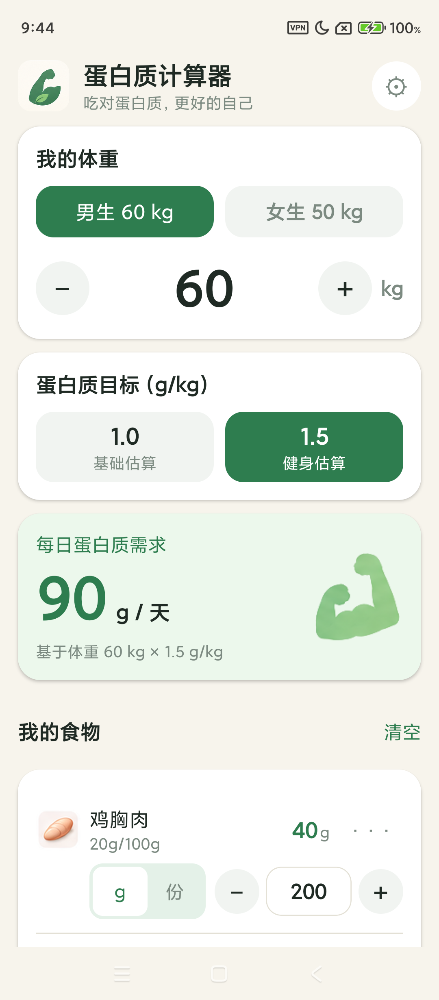
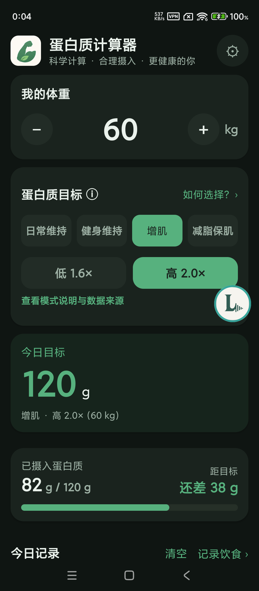
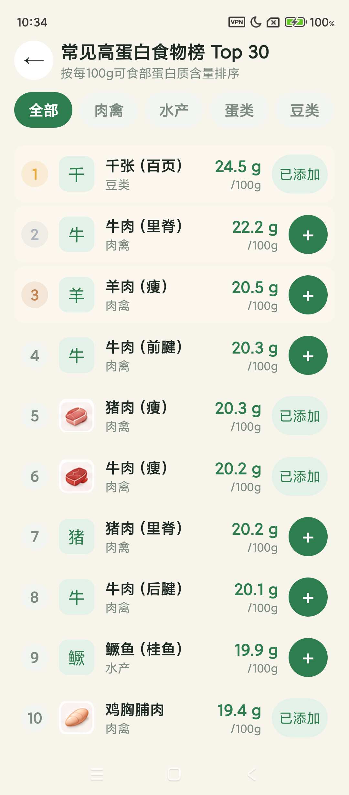

# 蛋白质计算器

> 不用注册、不用联网，几秒钟算出你每天要吃多少蛋白质，再帮你算出这顿饭吃了多少。

[English](./README.en.md)

  

## 这是什么

蛋白质计算器是一个 Android 单机 App（Expo + React Native）。它解决一个很具体的问题：健身或关注饮食的人想知道“我每天大概要吃多少蛋白质，以及几块鸡胸肉、几个鸡蛋、一瓶牛奶大概提供多少蛋白质”。

## 能做什么

- **算每日目标**：输入体重，选 4 种目标模式（日常维持 0.8–1.0、健身维持 1.2–1.6、增肌 1.6–2.0、减脂保肌 1.6–2.4 g/kg）再选低/高档，直接得到每天目标克数（60kg × 增肌低档 1.6 = 96g/天）。模式说明与数据来源在 App 内可查，离线可看。
- **算这顿吃了多少**：从食物列表调数量（按克/毫升/个，或块/瓶等常用份量），实时看总摄入、还差多少、进度条。
- **查高蛋白食物榜 Top 30**：30 种常见食物按每 100g 蛋白质含量排名，点 `+` 直接加入计算，留在榜单里可连续加多个。
- **改成自己的值**：预设食物的营养值、常用份量都能按实际包装改，也能加完全自定义的食物，可恢复默认。
- **下次打开接着用**：体重、系数、食物数量、自定义食物都存在本机，杀进程重开恢复；存坏了自动回默认，不闪退。
- **深色模式**：默认跟随系统明暗自动切换，也可在设置里手动选「跟随系统 / 浅色 / 深色」，选择保存在本机。
- **中英双语**：设置里一键切换中文 / English，偏好保存在本机，食物名、榜单、单位都会跟着变。

## 快速开始

需要：Node.js 22.13+，Android 手机/模拟器（已装 Expo Go 可直接预览）。

```bash
# 在 protein-calculator/ 目录执行
npm install
npx expo start
```

然后用手机 Expo Go 扫码，或按终端提示按 `a` 在模拟器打开。完整装机包：

```bash
npx expo prebuild --platform android
./android/gradlew -p android :app:assembleRelease
adb install -r android/app/build/outputs/apk/release/app-release.apk
```

## 数据来源

榜单数据来自中国疾病预防控制中心营养与健康所《中国食物成分表》查询平台（核验 2026-09），仅比较本应用收录的 30 种常见食物。App 内榜单底部有完整来源与说明卡，可离线查看。

## 限制

- 仅 Android（包名 `com.proteincalculator.app`），无 iOS 构建配置验证。
- 纯单机：无账号、无同步、无网络功能；换手机数据不迁移。
- 营养值为估算参考，以实际包装标签为准；不做热量/脂肪/碳水，不做医疗建议。

## 开发

```bash
npm run typecheck   # tsc --noEmit
npm run lint        # expo lint
npm test            # jest（非 watch）
npm run format:check
npx expo-doctor
```

## License

本仓库带有 `LICENSE` 文件（Expo 脚手架默认文本）。
